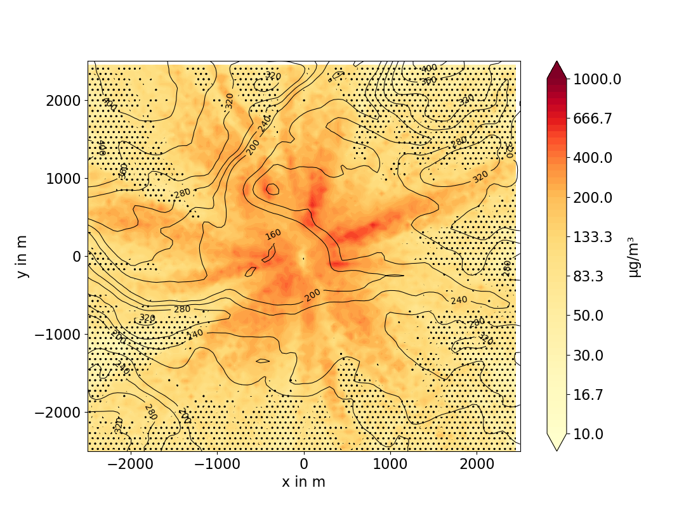
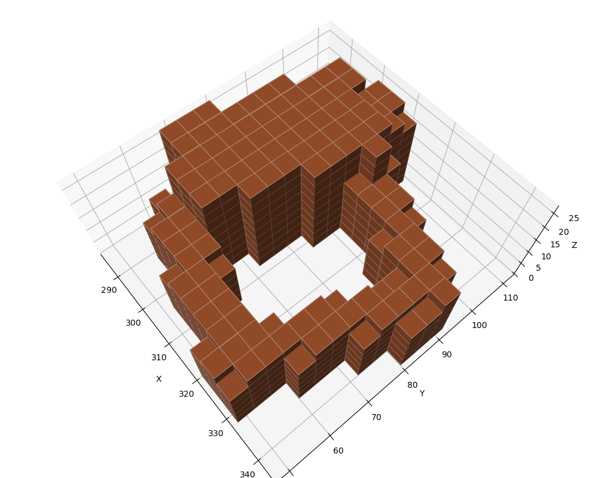
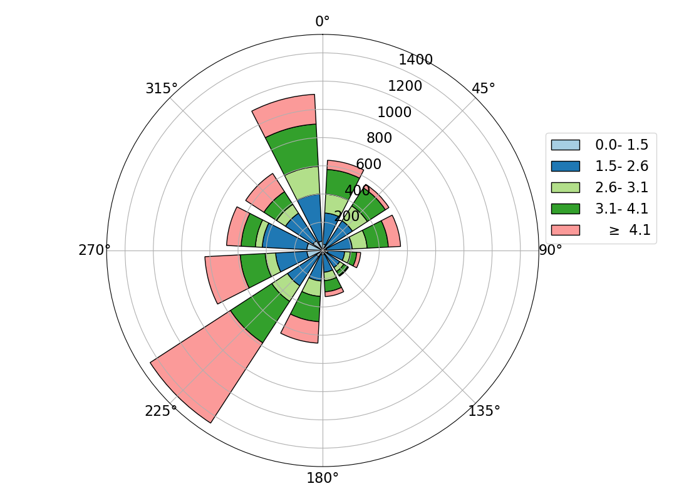
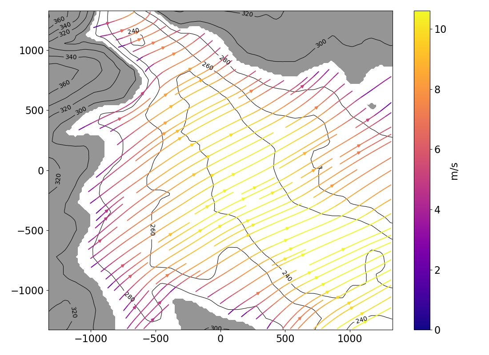

:orphan:

-----------
austaltools
-----------

.. argparse::
   :module: austaltools.command_line
   :func: cli_parser
   :prog: austaltools

   fill-timeseries (ft)
        Detailed userguide see: :doc:`fill-timeseries`

   heating
        For a description fo the heating description file ``
        see: :doc:`heating`

   plot
        A simple plot for a quick overview (click to enlarge)
        |plotcontour|

   volout
        Example plot of a buildings volume plot  (click to enlarge)
        |plotvolout|

   windfield
        Example plot of a windfield (click to enlarge)
        |plotwindfield|

   windrose
        Example plot of a windrose classified by wind speed quantiles         (click to enlarge)
        |plotwindrose|
